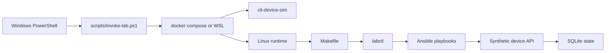
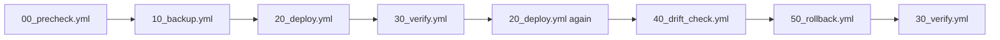

# ansible-convergence-lab

[](#quick-start)
[](#architecture)
[](#quick-start)
[](#repo-layout)
[](#what-you-learn)

Windows-first, local-only, synthetic Ansible training repo for people who want to learn the right automation loop from a Windows host without teaching the wrong control-node model.

Maintained in the open as a RedBeret-style teaching repo: practical, explicit, and safe to share.

This project is opinionated on purpose.

- Windows is the operator entrypoint.
- Linux is the Ansible runtime.
- Everything is synthetic.
- The demo path is fast, repeatable, and safe to post on GitHub.

## Why this repo exists

Most Windows-based automation learners hit the same wall:

- they want to operate from PowerShell
- they want to learn inventory, playbooks, roles, and idempotency
- they do not want fake guidance that treats Windows like a native Ansible control node

This repo solves that by keeping the host experience Windows-first while running Ansible where it belongs, inside Linux via Docker or WSL.

## What you learn

- Inventory structure with `inventories/local.yml`, `group_vars/`, and `host_vars/`
- Ordered playbook flow with precheck, backup, deploy, verify, drift check, and rollback
- Idempotency, including a second deploy that should report `changed=0`
- Backup strategy versus last-known-good strategy
- Drift injection and drift detection in a safe local simulator
- Health checks, validation, retries with backoff, timeouts, and structured logging

## What this repo is not

- Not a real network lab
- Not a vendor emulator
- Not a Windows-native Ansible control node pattern
- Not a place for customer data, real credentials, or proprietary images

## Safe by design

- Synthetic hostname: `edge-r1.lab.example`
- RFC5737 IP space only: `192.0.2.0/24`, `198.51.100.0/24`, `203.0.113.0/24`
- Fake serial: `SIM-EDGE-0001`
- Fake users: `ops_alice`, `ops_bob`
- Fake SSH keys using `example.invalid`
- Local SQLite state only

## Quick start

### Prerequisites

- Windows 10 or Windows 11
- PowerShell 7
- Docker Desktop with Linux containers enabled
- Optional: WSL2 Ubuntu if you want the alternate runtime path

### One-command demo

Run this from Windows PowerShell:

```powershell
pwsh ./scripts/demo.ps1 -Runtime docker -Build
```

What the demo does in under 5 minutes:

1. Resets the simulator to a blank synthetic state
2. Runs prechecks
3. Takes a backup
4. Deploys the desired config
5. Verifies the desired state
6. Runs deploy again and proves idempotency
7. Injects synthetic drift
8. Detects that drift
9. Rolls back to last-known-good
10. Verifies recovery

### Clean up

```powershell
pwsh ./scripts/down.ps1
```

## Architecture



## Demo workflow



## Primary commands

```powershell
pwsh ./scripts/demo.ps1 -Runtime docker -Build
pwsh ./scripts/invoke-lab.ps1 -Task deploy -Runtime docker
pwsh ./scripts/invoke-lab.ps1 -Task verify -Runtime docker
pwsh ./scripts/invoke-lab.ps1 -Task inject-drift -Runtime docker
pwsh ./scripts/invoke-lab.ps1 -Task rollback -Runtime docker
pwsh ./scripts/test.ps1 -Runtime docker
pwsh ./scripts/down.ps1
```

## Repo layout

```text
.
|-- compose.yml
|-- scripts/
|-- src/aclab/
|-- inventories/
|-- group_vars/
|-- host_vars/
|-- playbooks/
|-- roles/
|-- tests/
|-- docs/
|-- backups/
|-- reports/
`-- rendered/
```

Key areas:

- `scripts/` contains the Windows-first entrypoints
- `src/aclab/` contains the simulator and the Linux-side task runner
- `playbooks/` contains the ordered convergence loop
- `roles/` contains the reusable config units
- `tests/` contains smoke, idempotency, and drift-detection tests
- `docs/` contains the notes, runbooks, ADRs, and study material

## What gets generated

- `backups/` for timestamped backups and last-known-good artifacts
- `reports/` for run summaries, drift reports, and verification output
- `rendered/` for desired-state render artifacts
- `state/` for local simulator persistence

## Why the runtime split matters

This repo teaches a workflow that is honest about how Ansible is meant to run:

- the host can be Windows
- the operator can live in PowerShell
- the control runtime should still be Linux

That is the whole point of the design.

## Documentation

- [Engineering notes](docs/engineering-notes.md)
- [Study guide](docs/study-guide.md)
- [Runbook](docs/runbook.md)
- [Failure modes](docs/failure-modes.md)
- [Review questions](docs/review-questions.md)
- [ADRs](docs/adr/)
- [Publishing checklist](docs/publishing-checklist.md)

## Contributing

- [Contributing guide](CONTRIBUTING.md)
- [Security policy](SECURITY.md)
- [Changelog](CHANGELOG.md)

## Testing

The repo includes:

- playbook smoke coverage
- idempotency verification
- drift detection verification

Run the suite from Windows:

```powershell
pwsh ./scripts/test.ps1 -Runtime docker
```

## WSL note

The default path is Docker because it is the cleanest one-command demo from Windows.

The WSL path is still supported:

```powershell
pwsh ./scripts/demo.ps1 -Runtime wsl
```

That path assumes your WSL Ubuntu environment already has the required Linux-side dependencies available.

## Final note

If you want to learn Ansible from a Windows machine without building muscle memory around a bad control-node story, this repo is for you.
# ansible-convergence-lab
