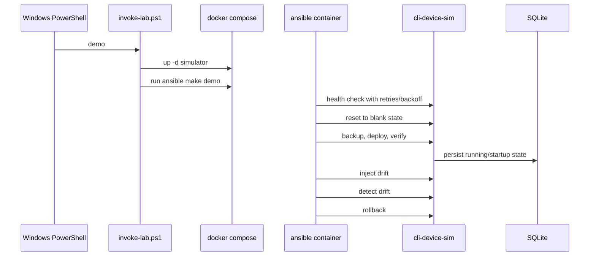

# Engineering Notes

## Why Windows is the entrypoint and Linux is the runtime

This repo teaches the operator experience many Windows teams actually have:

- The human starts from PowerShell.
- Ansible runs in Linux.
- The managed target is synthetic and local.

That split keeps the demo realistic without teaching a misleading pattern where Windows acts like a native Ansible control node.

## Runtime choice

- Default: Docker Compose on Windows
- Alternate: WSL2 Ubuntu calling `make`

Docker is the default because it gives a tighter one-command demo path and isolates the simulator plus Ansible runtime. WSL is supported for users who already maintain a Linux toolchain there.

## Why a synthetic simulator exists

The lab needed to be:

- Local-only
- Fast to reset
- Safe to drift
- Safe to roll back
- Explicitly free of real credentials and customer data

The Python simulator gives us deterministic state, a small HTTP API, and a SQLite-backed history without pretending to be a vendor emulator.

## Control flow

## Reliability features

- Structured logging:
  - Windows wrapper writes JSON lines to `reports/logs/windows-runner.jsonl`
  - `labctl` writes JSON lines to `reports/logs/labctl.jsonl`
  - The simulator writes JSON lines to `state/simulator.jsonl` inside the container volume
- Explicit validation:
  - Pydantic models validate simulator inputs
  - Ansible prechecks validate synthetic-only values
  - PowerShell validates runtime and task names
- Retries with backoff:
  - `labctl` health checks use exponential backoff
  - PowerShell retries `docker compose up` and optional image builds
- Timeouts:
  - PowerShell kills hung external processes
  - `labctl` applies command and HTTP timeouts
  - Ansible `uri` tasks use explicit timeouts
- Idempotent operations:
  - The simulator only reports change when state truly differs
  - The second deploy should recap with `changed=0`
- Health checks:
  - Docker Compose waits on `/healthz`
  - `labctl` waits again before running playbooks

## Why SQLite

SQLite is enough for a single synthetic device, gives durable local state, and is easy to inspect during training. It also lets the simulator support reset, drift, and rollback without standing up extra infrastructure.

## Tradeoffs

- This teaches convergence loops well, but not vendor module specifics.
- The simulator is intentionally smaller than a real NOS.
- The Docker path is easiest to demo, but requires image builds the first time.

