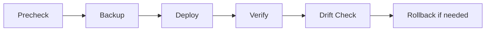

# Study Guide

## Start with the inventory

`inventories/local.yml` defines the synthetic host. `group_vars/synthetic_devices.yml` holds the shared desired state. `host_vars/edge-r1.lab.example.yml` holds per-device identity like the fake serial and management IP.

The key lesson is that inventory is not just a list of targets. It is where you model intent, scope, and safe defaults.

## Follow the playbook order

1. `00_precheck.yml`
2. `10_backup.yml`
3. `20_deploy.yml`
4. `30_verify.yml`
5. `40_drift_check.yml`
6. `50_rollback.yml`

This is the automation loop the repo is built to teach:

## Understand the roles

- `common_base`: baseline hostname, banner, and rendered artifacts
- `local_users`: synthetic local account state
- `interfaces`: interface descriptions and addressing
- `ssh_access`: synthetic SSH access policy

The playbook order plus roles mirror a common operational pattern:

- validate first
- capture current state
- apply small, understandable units of change
- verify outcomes
- preserve a rollback anchor

## Idempotency

In this lab, idempotency means:

- The first deploy changes the blank state into the desired state.
- The second deploy sees the same desired state and reports zero changes.

The simulator helps enforce that by returning `changed: false` when the requested state already matches the stored state.

## Backup and last-known-good

The repo uses two backup concepts:

- Timestamped backups from `10_backup.yml`
- Last-known-good backup from `30_verify.yml`

The first shows you what existed before a change. The second gives rollback a stable restore point that only updates after verification succeeds.

## Drift detection

Drift is any difference between the desired state and the running state. In this repo:

- `inject-drift` mutates the running config only
- `40_drift_check.yml` compares actual running state to the expected desired state
- rollback restores the verified state

## Questions to ask yourself while studying

- Which values belong in inventory versus in task logic?
- Which tasks mutate the device and which only observe it?
- Where is the idempotency guarantee enforced?
- Why is last-known-good written after verify instead of before deploy?

